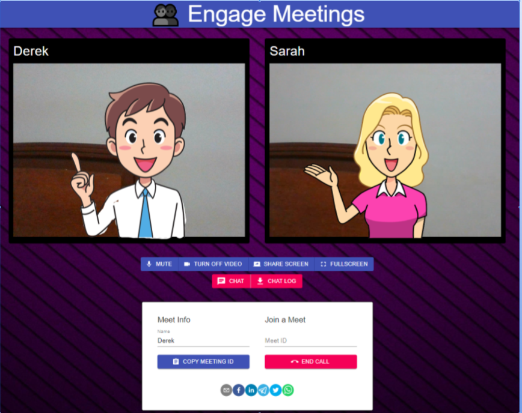
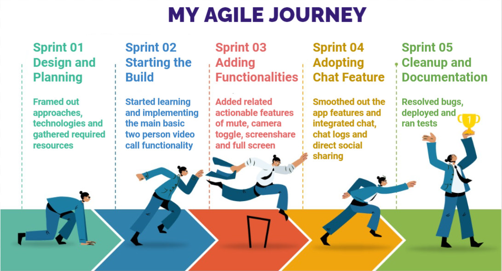
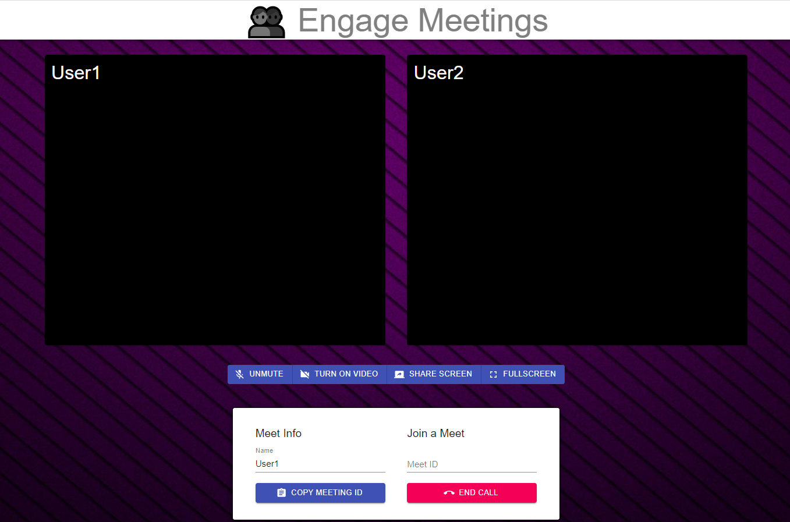
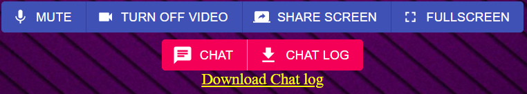
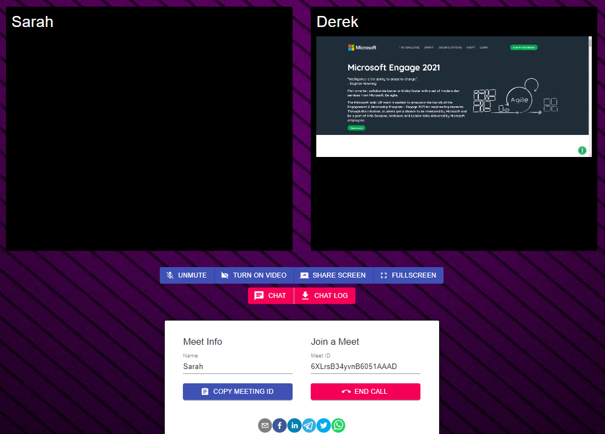
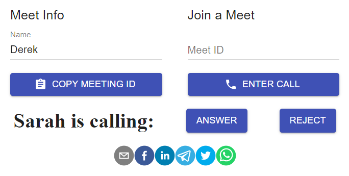
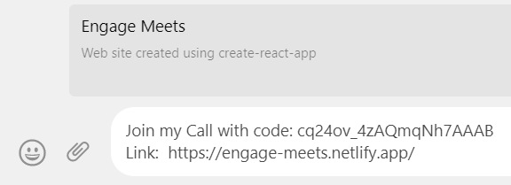
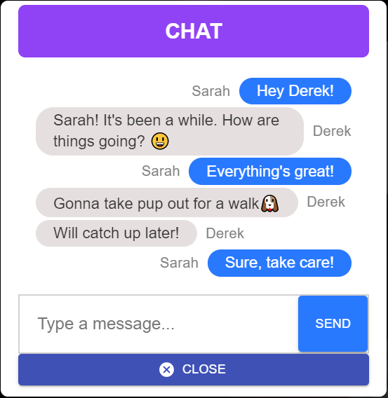
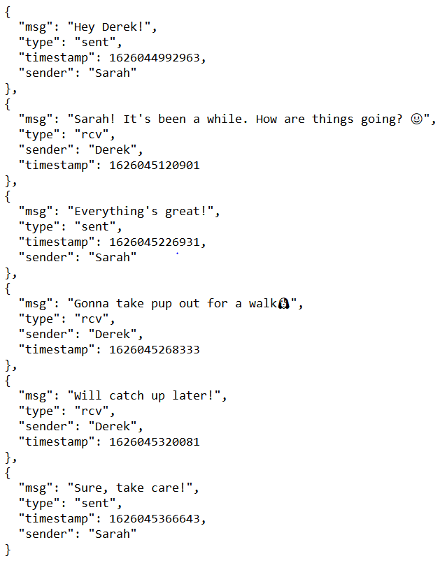


 

### [Live Site](https://engage-meets.netlify.app/)

 # Engage-Meets
 
 A WebRTC based Videocalling App created using ReactJS and NodeJS. 
 This was built as part of the Microsoft Engage 2021 Program.
 
 
 ## Features and Functionalities ⚙️
 
 1. Realtime Video-Calling between two users 👥
 2. Instant calling using Meet-ID 📞
 3. Ringtone based call notifications 🎵
 4. Audio mute/unmute 🎙️
 5. Camera disable/enable 📹
 6. Screen Sharing 💻
 7. Fullscreen option 🔎
 8. Responsive and cross-platform UI/UX 📱
 9. Directly Share ID and link through social media 📧
 10. Communicate through chat messages during the meet 💬
 11. Download the chat log for future references 📨
 
 ## Tech Stack Used
 
 1. NodeJs
 2. ReactJS
 3. WebRTC
 4. Socket.io
 
 ### Deployment
 
  Server Side : Heroku;
  Client Side : Netlify
 

 ## Video Demo 📽️
 
 
 ## App User Interface
 
 
 
 
 ### Agile Methodology
 
 
 
 
 ### Early Sprints Version
 
 
 
 
 ### Video Controls
 
 
 
 
 
 
 ### Making a call and joining the meet
 
 
 
 
 
 
  ### Adopt Chat Feature
 
 
 
 
 
 
 
